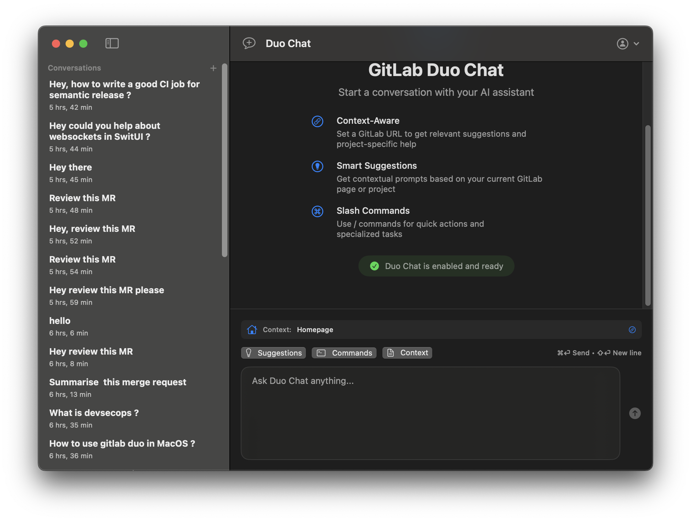

# Duo Chat MacOS client

An **unofficial** macOS wrapper for GitLab Duo, GitLab's AI-powered chat assistant. This native SwiftUI application provides a clean, modern interface to interact with GitLab Duo outside of the GitLab web interface.



> **Note**: This is an unofficial third-party application and is not affiliated with or endorsed by GitLab Inc.

## About GitLab Duo

GitLab Duo is GitLab's AI-powered assistant that helps developers with coding tasks, code reviews, documentation, and general development questions. This wrapper application brings that functionality to a dedicated macOS app.

## Features

- **GitLab Duo Integration**: Direct access to GitLab's AI assistant capabilities
- **Native macOS Experience**: Clean SwiftUI interface optimized for macOS
- **Real-time Communication**: WebSocket-based messaging with GitLab Duo
- **Authentication**: Secure GitLab account integration
- **Rich Message Display**: Markdown support for code snippets and formatted responses
- **Thread Management**: Organize your AI conversations in threads
- **Status Indicators**: Connection status and message delivery confirmation

## TODO
- **Provide Custom Context**: Allow users to provide custom gitlab context for better AI responses
- **Support MCP**: Implement support for model control protocol
- **Support Model Selection**: Allow users to select different AI models for their conversations

## Architecture

### Core Components

- **ChatService**: Handles GitLab Duo message processing and chat logic
- **WebSocketManager**: Manages real-time communication with GitLab Duo API
- **AuthenticationService**: GitLab account authentication and session management
- **GraphQLResponse**: GitLab API response handling and data models

### UI Components

- **ChatView**: Main chat interface
- **SidebarView**: Thread navigation and management
- **MessageView**: Individual message display with support for user and assistant messages
- **MarkdownView**: Rich text rendering for formatted content
- **SuggestionsView**: Command suggestions and autocomplete
- **AuthenticationView**: Login and user management interface


## Prerequisites

- **GitLab Account**: You need a GitLab account with access to GitLab Duo
- **macOS**: 12.0 or later
- **Xcode**: 14.0 or later (for development)
- **Swift**: 5.7 or later (for development)
- **make**: The `make` command should be available in your shell.

## Build

The project includes a `Makefile` that simplifies common tasks like building, testing, and creating distribution packages.

### Makefile Targets

- `make build`: Build the debug version of the application.
- `make build-release`: Build the release version and create distributable `.zip` and `.dmg` packages.
- `make test`: Run both unit and UI tests.
- `make clean`: Remove all build artifacts.
- `make install`: Install the release version of the app to the `/Applications` directory.
- `make run`: Build and run the debug version of the app.
- `make help`: Show a list of all available `make` targets.

## Homebrew

We are working on making Duo Chat available via Homebrew. The formula is available in this repository, but it is not yet functional. For now, you will need to build from source.

```bash
# This is a placeholder for the future
brew install --formula ./HomebrewFormula/duo-chat.rb
```

## Setup

1. **GitLab Duo Access**: Ensure you have access to GitLab Duo in your GitLab account
2. Clone the repository:
   ```bash
   git clone https://gitlab.com/tachyons-gitlab/duo-chat-macos
   cd duo-chat
   ```

3. Build and run the project:
   ```bash
   make run
   ```
4. Sign in with your GitLab credentials when prompted

## Configuration

The app uses entitlements defined in `duo_chat.entitlements` for macOS-specific permissions and capabilities.

## Development

### Building

The project includes a CI/CD pipeline configured in `.gitlab-ci.yml` for automated building and testing.

To build locally:
```bash
make build
```

### Testing

Run the test suite:
```bash
make test
```


## Important Notes

- **Unofficial Project**: This is not an official GitLab product and is not supported by GitLab Inc.
- **Terms of Service**: By using this application, you agree to comply with GitLab's Terms of Service
- **API Usage**: This app uses GitLab's APIs and is subject to their rate limits and usage policies
- **Data Privacy**: All conversations are processed through GitLab's servers according to their privacy policy

## Contributing

We welcome contributions to improve this unofficial GitLab Duo wrapper!

1. Fork the repository
2. Create a feature branch (`git checkout -b feature/amazing-feature`)
3. Commit your changes (`git commit -m 'Add some amazing feature'`)
4. Push to the branch (`git push origin feature/amazing-feature`)
5. Open a Pull Request

### Development Guidelines
- Respect GitLab's API rate limits
- Follow GitLab's API best practices
- Maintain compatibility with GitLab Duo updates
- Test authentication flows thoroughly

## Disclaimer

This project is an independent effort to create a better user experience for GitLab Duo users on macOS. It is not affiliated with, endorsed by, or officially connected to GitLab Inc. GitLab and GitLab Duo are trademarks of GitLab Inc.

## Support

For issues related to this wrapper application, please open an issue in this repository. For GitLab Duo functionality questions, please refer to [GitLab's official documentation](https://docs.gitlab.com/ee/user/gitlab_duo_chat.html).

---
